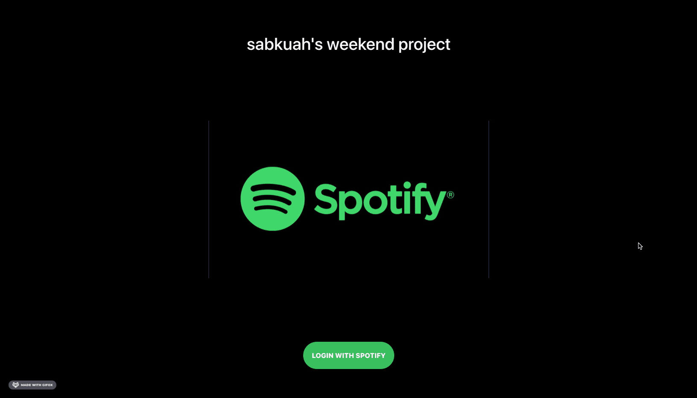

# Spotify-Clone - by Sabrina Kuah, Winter Break 2020

## Live Site: https://spotify-sabkuah.web.app/#

### Project Features
- Login redirect to Spotify for user authentication 
- Web app pulls user's avatar, list of playlists and 20 most recently played tracks from SpotifyWebAPI

### Demo

### Libraries

- React-Router-DOM
- React Icons
- Jquery, Popper.js
- Axios
- SASS
- Material-UI Icons

## Spotify API information

- npm i spotify-web-api-js
